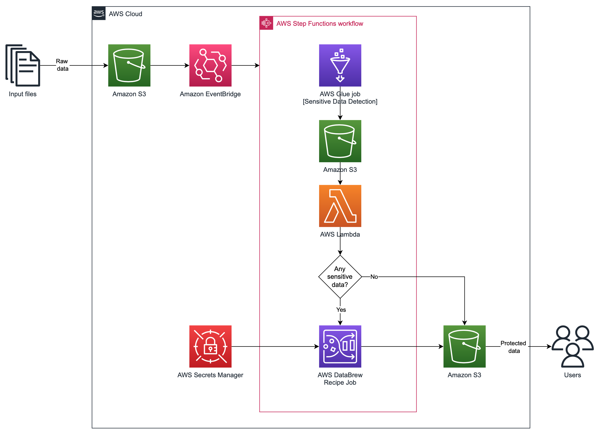

# Detect and handling custom senstive data with AWS Glue Studio and AWS Glue DataBrew



This repository provides an [AWS CloudFormation](https://aws.amazon.com/cloudformation/) (CFn) template that builds sample a data pipeline, with the functionality of identifying personal and sensitive data using the Sensitive Data Detection feature of [AWS Glue Studio](https://docs.aws.amazon.com/glue/latest/ug/what-is-glue-studio.html) and apply hashing algorithm to protect columns identified with the use of [AWS Glue DataBrew](https://aws.amazon.com/glue/features/databrew/), through an event-driven and [serverless](https://aws.amazon.com/serverless/) architecture.

**Note:** Although the data contained in the [sample file](sample-synthetic-PII-ptbr.csv) respects the real format, they are fictious data generated randomly, respecting the rules for creating each document.
The misuse of the data generated here is the sole responsibility of the user.

## Use Agreement

We recommend that you use this template as a starting point for creating your own template, not for launching production-level environments. Before launching a template, always review the resources and policies that it will create and the permissions it requires. Using this code `I Agree` I'm solely responsible for any security issue caused due any misconfiguration and/or bugs.

## Instructions

### Creating data pipeline 

1. <a href="https://console.aws.amazon.com/cloudformation/home?#/stacks/new">Launch the AWS CloudFormation stack</a> using the `cfn-demo-detect-and-handling-custom-pii.yaml` template file as the source.

To get the template, download the CFn template file [here](cfn-demo-detect-and-handling-custom-pii.yaml) or clone the repository.
```
git clone git@github.com:aws-samples/detect-and-handling-custom-pii-with-aws-glue-studio-and-aws-glue-databrew.git
```
**Note**: Check AWS account and region before stack deploy.

2. CFn template provides 12 parameters filled by default, 5 custom sensitive data name (`1CustomSensitiveDataName`, `2CustomSensitiveDataName`, `3CustomSensitiveDataName`,
`4CustomSensitiveDataName`, `5CustomSensitiveDataName`), their respective regular expression (`1CustomSensitiveDataValue`,`2CustomSensitiveDataValue`,`3CustomSensitiveDataValue`,`4CustomSensitiveDataValue`,`5CustomSensitiveDataValue`) to detect some Personally Identifiable Information (PII) from Brazil (CPF, RG, CNPJ, CEP and Telefone), percentage of rows to sample (`GlueSamplePortion`) and percentage of rows that contain the sensitive data (`GlueDetectionThreshold`). You can edit these parameters if you prefer. 
Provide a value for `SecretString` parameter, that will be base64 encoded as a secret (AWS Secrets Manager) and used for data hashing.

### Running data pipeline 

1. After deploying CFn stack, get output parameters in Outputs section `AmazonS3BucketForDataInput`, `AWSStepFunctionsStateMachine` and `AmazonS3BucketForDataOuput`. It will be useful in the next steps!

2. Customers who decide example data to leverage, download sample synthetic file [here](sample-synthetic-PII-ptbr.csv) generated by [4devs](https://www.4devs.com.br/gerador_de_pessoas) or use any other generator.


**Note**: File must be a CSV with semicolon (`;`) delimiter (semicolon was chosen in this solution because it causes less problems with decimal points, digit grouping and does not appear in much text).

3. Upload file with sensitive data in the input bucket created before (`AmazonS3BucketForDataInput`).

4. Wait until AWS Step Functions state machine (`AWSStepFunctionsStateMachine`) ends, you can watch the execution.

5. After completed, download generated file in output bucket created before (`AmazonS3BucketForDataOuput`).


## Additional Resources
In the *AWS CloudFormation User Guide*, you can view more information about the following topics:

- Learn how to use templates to create AWS CloudFormation stacks using the [AWS Management Console](http://docs.aws.amazon.com/AWSCloudFormation/latest/UserGuide/cfn-console-create-stack.html) or [AWS Command Line Interface (AWS CLI)](http://docs.aws.amazon.com/AWSCloudFormation/latest/UserGuide/using-cfn-cli-creating-stack.html).
- To view all the supported AWS resources and their properties, see the [Template Reference](http://docs.aws.amazon.com/AWSCloudFormation/latest/UserGuide/template-reference.html).

## Security

See [CONTRIBUTING](CONTRIBUTING.md#security-issue-notifications) for more information.

## License

This library is licensed under the MIT-0 License. See the LICENSE file.

